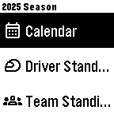
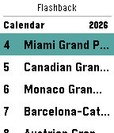
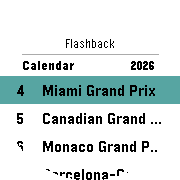
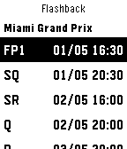
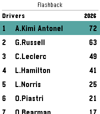

<table align="center">
  <tr>
    <th>Pebble Classic</th>
    <th>Pebble Time</th>
    <th>Pebble Time Round</th>
    <th>Pebble 2</th>
    <th>Pebble 2 Duo</th>
    <th>Pebble Time</th>
  </tr>
  <tr>
    <th>aplite</th>
    <th>basalt</th>
    <th>chalk</th>
    <th>diorite</th>
    <th>emery</th>
    <th>flint</th>
  </tr>
  <tr>
    <td></td>
    <td></td>
    <td></td>
    <td></td>
    <td></td>
    <td></td>
  </tr>
</table>

<h1 align="center">Flashback for Pebble</h1>

<p align="center">
  <a href="https://github.com/thementalgoose/pebble-flashback/releases"></a>
  <a href="https://developer.rebble.io/"></a>
  <a href="https://dev-portal.rebble.io/"></a>
</p>

Pebble watch app for the Flashback API 🎉

### Currently supported

- [x] Calendar view (with races split by Upcoming and Previous)
- [x] Race schedule view per race
- [x] Drivers standings
- [x] Teams standings

#### Building

- Python 3.10.x required

```bash
# Booting the emulator
pebble install --emulator flint

# Building
pebble build

# Running
pebble install
pebble install --cloudpebble 
pebble install --emulator flint --logs
```

#### Useful Links

- [Hardware information](https://developer.rebble.io/guides/tools-and-resources/hardware-information/)
- [UI Samples](https://github.com/pebble-examples/ui-patterns/)
- [Modular Architecture](https://github.com/pebble-examples/modular-app-example/blob/master/src/windows/main_window.h)
- [Best Practices](https://developer.rebble.io/guides/best-practices/modular-app-architecture/)
