<h1 align="center">Flashback for Pebble</h1>

<p align="center">
  <a href="https://github.com/thementalgoose/pebble-flashback/releases"></a>
  <a href="https://apps.rebble.io/en_US/application/6929da3470731e00092debea"></a>
  <a href="https://dev-portal.rebble.io/"></a>
</p>

| Codename | Pebble name       | Menu | Calendar | Drivers |
|----------|-------------------|------|----------|---------|
| basalt   | Pebble Time       | 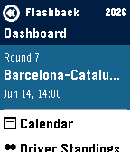  | 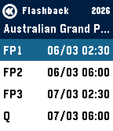  | 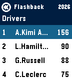  |
| chalk    | Pebble Time Round | 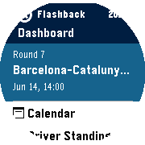   | 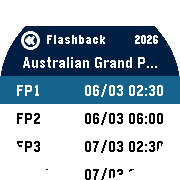   | 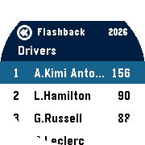   |
| diorite  | Pebble 2          | 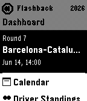 | 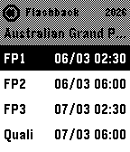 | 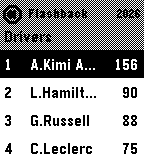 |
| emery    | Pebble 2 Duo      | 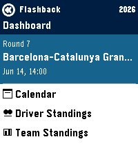   | 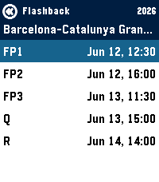   | 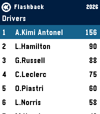   |
| flint    | Pebble Time 2     |    |    |    |
| gabbro   | Pebble Round 2    | 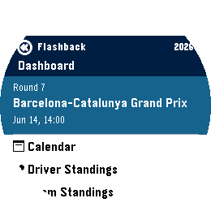  | 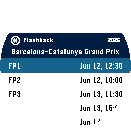  | 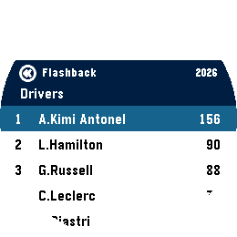  |

Pebble watch app for the Flashback API 🎉

### Currently supported

- [x] Calendar view (with races split by Upcoming and Previous)
- [x] Race schedule view per race
- [x] Drivers standings
- [x] Teams standings

#### Building

- Python 3.10.x required

```bash
# Booting the emulator
pebble install --emulator flint

# Building
pebble build

# Running
pebble install
pebble install --cloudpebble 
pebble install --emulator flint --logs
```

#### Useful Links

- [Hardware information](https://developer.rebble.io/guides/tools-and-resources/hardware-information/)
- [UI Samples](https://github.com/pebble-examples/ui-patterns/)
- [Modular Architecture](https://github.com/pebble-examples/modular-app-example/blob/master/src/windows/main_window.h)
- [Best Practices](https://developer.rebble.io/guides/best-practices/modular-app-architecture/)
